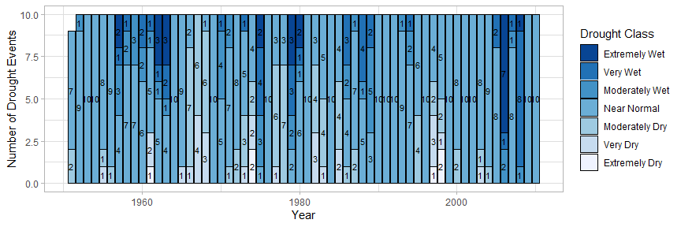

droughtR
================


droughtR is an R for package that enables drought monitoring and drought
forecasting. It computes the Standardized Precipitation Index (SPI) and
the Non-Standardized Precipitation Index (NSPI) using General Additive
Models for Location Scale and Shape (GAMLSS). It enables the generation
of drought forecasts for univariate time series and deals with the bias
introduced to drought forecasting applications when SPI and NSPI are
calculated incorrectly during out-of-sample (OOS) validation.

## Installation

``` r
# Install the development version on Github
devtools::install_github("mammask/droughtr")
```

## Usage

### Generate SPI and NSPI

``` r
# Load droughtr library
library(droughtr)

# Generate synthetic monthly rainfall data using the Gamma distribution
rain = dummyrainfall(startYear = 1950, endYear = 2010)

# Compute the non-stationary standardized precipitation index (NSPI) for scale 12 using GAMLSS
drought = computenspi(monthlyRainfall = rain, stationary = FALSE, spiScale = 12)
#> GAMLSS-RS iteration 1: Global Deviance = 3259.784 
#> GAMLSS-RS iteration 2: Global Deviance = 3259.418 
#> GAMLSS-RS iteration 3: Global Deviance = 3259.418

# Plot NSPI
plot(drought)
```

<!-- -->

### Reduced-Bias forecasting framework

#### Data Split

Split the rainfall series into training validation and test set.

``` r
rain = oossplit(x = rain, trainratio = 0.6, validationratio = 0.2, testratio = 0.2)
print(rain)
#>          Date  Rainfall AccumPrecip Trend       mu      sigma     ecdfm
#>   1: Jan 1950  9.095422          NA    NA       NA         NA        NA
#>   2: Feb 1950  8.634021          NA    NA       NA         NA        NA
#>   3: Mar 1950  8.063726          NA    NA       NA         NA        NA
#>   4: Apr 1950  5.387627          NA    NA       NA         NA        NA
#>   5: May 1950  6.729949          NA    NA       NA         NA        NA
#>  ---                                                                   
#> 606: Jul 2010 10.817020    97.33481   595 96.19384 0.03052179 0.6544087
#> 607: Aug 2010  9.586061    99.39403   596 96.19453 0.03049826 0.8618907
#> 608: Sep 2010  7.037197   100.51913   597 96.19522 0.03047476 0.9283420
#> 609: Oct 2010  8.021090    98.87314   598 96.19591 0.03045127 0.8200981
#> 610: Nov 2010  9.045443   100.33951   599 96.19659 0.03042779 0.9200893
#>           NSPI Split
#>   1:        NA  <NA>
#>   2:        NA  <NA>
#>   3:        NA  <NA>
#>   4:        NA  <NA>
#>   5:        NA  <NA>
#>  ---                
#> 606: 0.3972508  Test
#> 607: 1.0888531  Test
#> 608: 1.4635534  Test
#> 609: 0.9157391  Test
#> 610: 1.4056724  Test
```

#### Bias measurement

When the Standardized Precipitation Index is calculated as part of a
forecasting task it can potentially introduce biases in the training
data. This is mainly because in many cases the index is computed using
the entire data, prior to model validation, and this violates some of
the fundamental principles of time series forecasting theory.

In this section, we compute the amount of bias introduced to the
training set by measuring the number of miss-classifications in the
training data. Two computational approaches are presented: 1) SPI is
computed using the training data only; we call this as “Bias Corrected”
computation and 2) SPI is computed using the entire data; we call this
as “Bias Induced” computation.

We measure bias by computing the number of miss-classifications in the
training set due to the incorrect computation of the index. We also
measure the number of records impacted and share a plot of the two
computational approaches.

``` r
# Generate synthetic monthly rainfall data using the Gamma distribution
rain = dummyrainfall(startYear = 1950, endYear = 2010)

# Compute bias
bias = measurebias(x = rain, trainratio = 0.6, validationratio = 0.2, testratio = 0.2, stationary = TRUE, spiscale = 12)
bias
#> $Transitions
#>     Bias Corrected Class Bias Induced Class   N
#>  1:          Near Normal        Near Normal 225
#>  2:       Moderately Dry     Moderately Dry  36
#>  3:       Moderately Wet     Moderately Wet  33
#>  4:        Extremely Wet      Extremely Wet   6
#>  5:             Very Wet           Very Wet  25
#>  6:       Moderately Wet           Very Wet   3
#>  7:             Very Dry      Extremely Dry   1
#>  8:             Very Dry           Very Dry  18
#>  9:          Near Normal     Moderately Wet   1
#> 10:             Very Wet      Extremely Wet   1
#> 11:        Extremely Dry      Extremely Dry   6
#> 
#> $`Impacted Records`
#> [1] "1.69% of records changed drought class"
#> 
#> $Plot
```

<!-- -->
