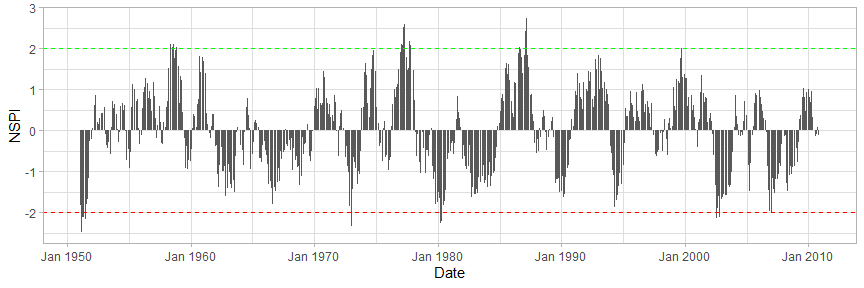

droughtr
================

## Overview

droughtr is an R for package that enables drought monitoring and drought
forecasting. It computes the Standardized Precipitation Index (SPI) and
the Non-Standardized Precipitation Index (NSPI) using General Additive
Models for Location Scale and Shape (GAMLSS). It enables the generation
of drought forecasts for univariate time series and deals with the bias
introduced to drought forecasting applications when SPI and NSPI are
calculated incorrectly during out-of-sample (OOS) validation.

## Installation

``` r
# Install the development version on Github
devtools::install_github("mammask/droughtr")
```

## Usage

### Generate SPI and NSPI

``` r
# Load droughtr library
library(droughtr)

# Generate synthetic monthly rainfall data using the Gamma distribution
rain = dummyrainfall(startYear = 1950, endYear = 2010)

# Compute the non-stationary standardized precipitation index (NSPI) for scale 12 using GAMLSS
drought = computenspi(monthlyRainfall = rain, stationary = FALSE, spiScale = 12)
```

    ## GAMLSS-RS iteration 1: Global Deviance = 3351.123 
    ## GAMLSS-RS iteration 2: Global Deviance = 3351.123

``` r
# Plot NSPI
plot(drought)
```

<!-- -->

### Reduced-Bias forecasting framework

#### Data Split

Split the rainfall series into training validation and test set.

``` r
rain = oossplit(x = rain, trainratio = 0.6, validationratio = 0.2, testratio = 0.2)
print(rain)
```

    ##          Date Rainfall AccumPrecip Trend       mu      sigma     ecdfm
    ##   1: Jan 1950 8.963740          NA    NA       NA         NA        NA
    ##   2: Feb 1950 6.842699          NA    NA       NA         NA        NA
    ##   3: Mar 1950 9.733336          NA    NA       NA         NA        NA
    ##   4: Apr 1950 9.281883          NA    NA       NA         NA        NA
    ##   5: May 1950 5.991393          NA    NA       NA         NA        NA
    ##  ---                                                                  
    ## 606: Jul 2010 6.596219    95.75331   595 94.44552 0.04640350 0.6226657
    ## 607: Aug 2010 8.370766    97.19793   596 94.44070 0.04642140 0.7383734
    ## 608: Sep 2010 6.576684    93.82330   597 94.43589 0.04643931 0.4504604
    ## 609: Oct 2010 7.930722    93.67659   598 94.43107 0.04645722 0.4376445
    ## 610: Nov 2010 7.884576    93.43627   599 94.42626 0.04647514 0.4164924
    ##            NSPI Split
    ##   1:         NA  <NA>
    ##   2:         NA  <NA>
    ##   3:         NA  <NA>
    ##   4:         NA  <NA>
    ##   5:         NA  <NA>
    ##  ---                 
    ## 606:  0.3124895  Test
    ## 607:  0.6383388  Test
    ## 608: -0.1244981  Test
    ## 609: -0.1569439  Test
    ## 610: -0.2108750  Test

#### Bias measurement

When the Standardized Precipitation Index is calculated as part of a
forecasting task it can potentially introduce biases in the training
data. This is mainly because in many cases the index is computed using
the entire data, prior to model validation, and this violates some of
the fundamental principles of time series forecasting theory.

In this section, we compute the amount of bias introduced to the
training set by measuring the number of miss-classifications in the
training data. Two computational approaches are presented: 1) SPI is
computed using the training data only; we call this as “Bias Corrected”
computation and 2) SPI is computed using the entire data; we call this
as “Bias Induced” computation.

``` r
# Generate synthetic monthly rainfall data using the Gamma distribution
rain = dummyrainfall(startYear = 1950, endYear = 2010)

# Compute bias
bias = measurebias(x = rain, trainratio = 0.6, validationratio = 0.2, testratio = 0.2, stationary = TRUE, spiscale = 12)
bias
```

    ## $Transitions
    ##     Bias Corrected Class Bias Induced Class   N
    ##  1:          Near Normal        Near Normal 227
    ##  2:       Moderately Dry        Near Normal  17
    ##  3:       Moderately Wet        Near Normal  15
    ##  4:       Moderately Wet     Moderately Wet  24
    ##  5:             Very Wet           Very Wet  12
    ##  6:        Extremely Wet      Extremely Wet   3
    ##  7:        Extremely Wet           Very Wet   8
    ##  8:             Very Dry     Moderately Dry   6
    ##  9:             Very Dry           Very Dry   9
    ## 10:        Extremely Dry           Very Dry   6
    ## 11:       Moderately Dry     Moderately Dry  22
    ## 12:             Very Wet     Moderately Wet   6
    ## 
    ## $`Impacted Records`
    ## [1] "16.34% of records changed drought class"
    ## 
    ## $Plot

<!-- -->
